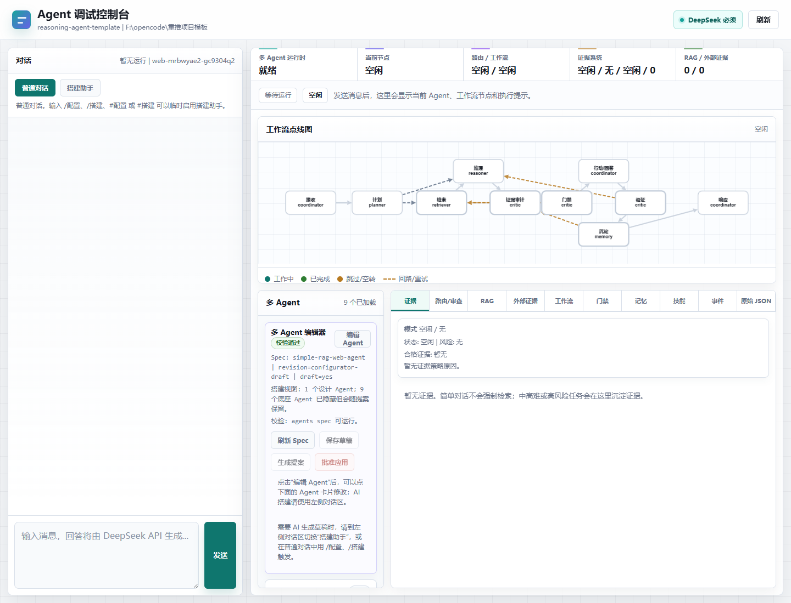
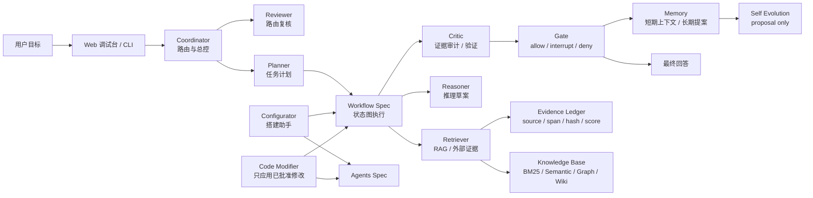
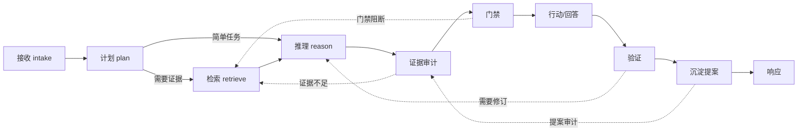
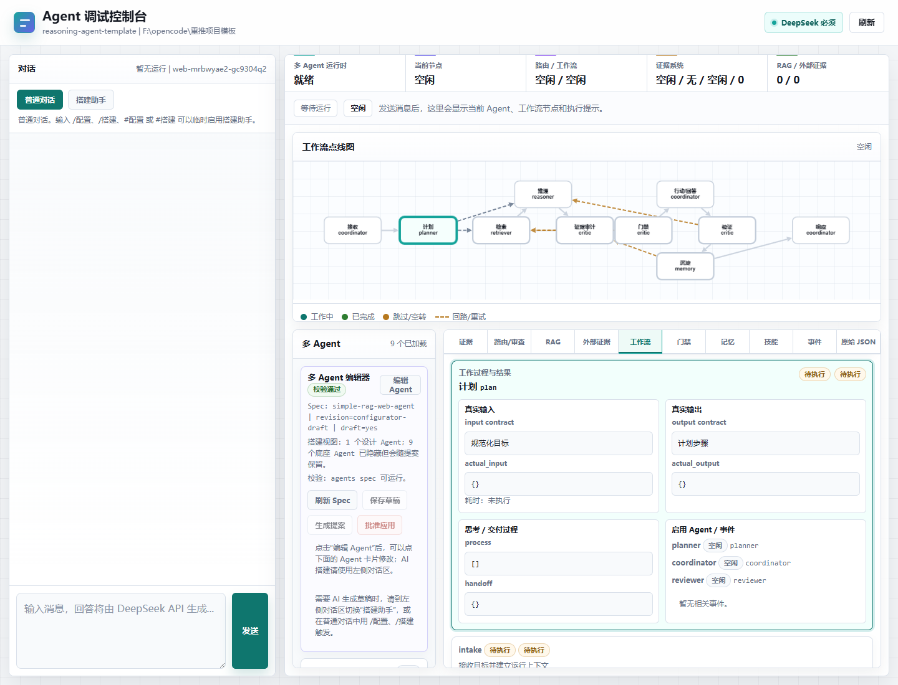
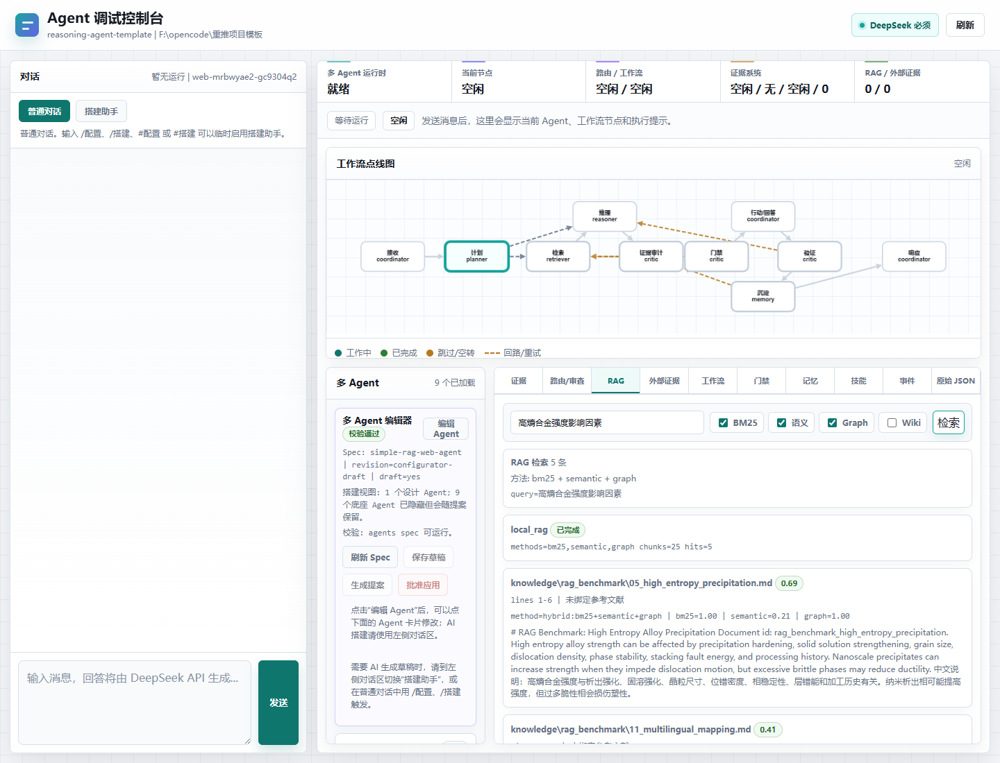

# DeepReason Agents Framework

DeepReason Agents Framework 是一个面向“重推理任务”的本地优先 Multi-Agent 底层框架。它把多 Agent 编排、可编辑工作流、证据系统、RAG、长短期记忆、门禁、技能包、自进化提案和调试控制台放在同一套可运行模板里，适合用来开发研究型、审查型、工程决策型和高风险知识工作 Agent。

> 核心目标：简单任务轻量回答，复杂任务自动进入证据工作流；所有高风险结论、记忆沉淀和代码/配置修改都必须可审计、可回放、可门禁。

## 先读文档和使用说明

如果你是第一次打开这个项目，建议先按下面顺序阅读：

1. [用户手册与学习手册](docs/user-manual.md)：完整解释每个功能区、每个 Tab、节点结构化输出、证据/RAG/门禁/记忆机制，以及如何基于框架做开发。
2. [使用说明图片卡片](docs/usage-cards.md)：8 张小尺寸流程图，适合写笔记、做教程或快速讲解。
3. [完整使用指南](docs/usage-guide.md)：快速了解运行、配置、知识库、工作流和二开流程。
4. [工作流编辑器使用说明](docs/workflow-editor-usage.md)：专门学习如何编辑节点、连线、门禁、交付契约和 proposal。
5. [RAG 索引指南](docs/rag-indexing-guide.md)：学习如何初始化知识库、切换 BM25/语义/Graph/Wiki 检索。
6. [AgentOps 硬化审查记录](docs/agentops-hardening.md)：查看本次底座核查、修复项、验收命令和未覆盖的生产条件。



## 亮点

- **多 Agent 架构**：coordinator、planner、retriever、reasoner、critic、memory、reviewer、configurator、code_modifier 等角色可配置、可扩展。
- **动态工作流图**：工作流由 `configs/workflows/*.workflow.json` 驱动，运行时按边执行分支和受控重试，并暴露节点、边、门禁、交付契约和检查点。
- **证据优先**：困难、学术、事实、技术判断和高风险任务会触发 RAG、论文/网页、用户经验等证据收集。
- **RAG 可切换**：内置 BM25、语义近似、Graph 关系扩展、Wiki fallback，可单独切换或联用。
- **长短期记忆边界**：短期记忆按 thread 保存上下文并可由本地 SessionStore 恢复；长期记忆分区落盘，写入必须经过 gate；知识库和记忆明确隔离。
- **自进化但不自改核心**：失败案例、证据和反馈只生成 proposal，不直接修改技能、配置或记忆。
- **可视化调试台**：实时查看 Agent 状态、工作流节点、证据、RAG 结果、门禁、记忆、技能、事件和原始 JSON。
- **开发者友好**：CLI、Web UI、unittest、RAG benchmark、workflow/agent spec、code modifier adapter 都已内置。

## 架构图



## 默认工作流

默认工作流不是一条死链，而是带局部回路的可审计状态图：





## 模块地图

| 模块 | 位置 | 功能 |
|---|---|---|
| Web 调试台 | `src/reasoning_agent_template/web.py`, `web_static/` | 提供中文对话界面、Agent 状态、工作流图、RAG、证据、门禁、记忆和事件监控。 |
| CLI | `src/reasoning_agent_template/cli.py` | 运行 chat、web、skills、test、rag-eval、deepseek-smoke 等命令。 |
| 多 Agent 编排 | `src/reasoning_agent_template/multiagent.py` | 负责路由、调用 LLM、推进工作流、收集调试 telemetry。 |
| Agent Spec | `configs/agents/default.agents.json`, `agents_spec.py` | 定义角色、职责、工具、权限、记忆访问和绑定节点。 |
| Workflow Spec | `configs/workflows/default.workflow.json`, `workflow_spec.py` | 定义节点、连线、handler、gate、handoff contract 和 checkpoint。 |
| Agent 模板库 | `configs/templates/builtin/`, `agent_templates.py` | 内置可复用 Agent/Workflow 模板；当前内置 `AutoResearch Agent`，支持保存用户模板并快速切换到草稿。 |
| 证据系统 | `src/reasoning_agent_template/models.py`, `evidence/ledger.jsonl` | 归一化 evidence item，记录 source、span、hash、confidence 和引用关系。 |
| 门禁系统 | `src/reasoning_agent_template/gates.py` | 对回答、文件写入、记忆写入、技能更新、命令执行等动作做 allow/interrupt/deny。 |
| RAG / 知识库 | `src/reasoning_agent_template/knowledge.py` | 本地文档 ingest、chunk、BM25、语义近似、Graph 检索、Wiki fallback。 |
| RAG 评测 | `src/reasoning_agent_template/rag_eval.py`, `configs/rag_benchmark_cases.json` | 用固定 benchmark 评估 Recall@K 和索引效果。 |
| 记忆系统 | `memory/`, `multiagent.py` | 短期 thread memory + 长期分区 memory；长期写入需要证据和 gate。 |
| 技能系统 | `skills/*/SKILL.md` | 把强约束 skill 化，如 evidence-first、minimal-change、self-evolution。 |
| 自进化 | `evolution/proposals/` | 根据失败案例、证据和反馈生成 proposal，不直接改核心资产。 |
| 配置助手 | Web 左侧“搭建助手” / `/配置` | 用自然语言生成 Agent 和 Workflow draft，供人工审查。 |
| 代码修改器 | `.opencode/agents/code-modifier.md`, `code_modifier.py` | 只应用已批准的代码/配置修改，禁止写 secrets、logs、evidence、memory。 |

## 快速开始

### 1. 准备环境

```powershell
git clone https://github.com/redmaplewww/DeepReason-Agents-Framework.git
cd DeepReason-Agents-Framework
$env:PYTHONPATH='src'
python -m unittest discover -s tests -v
```

本项目默认只依赖 Python 标准库即可跑通测试。可选安装：

```powershell
pip install -e .[deepagents]
```

### 2. 配置 DeepSeek

推荐使用本地 secret 文件，文件已被 `.gitignore` 排除：

```json
{
  "deepseek_api_key": "sk-替换成你的-key",
  "deepseek_model": "deepseek-v4-flash",
  "deepseek_timeout_seconds": 60
}
```

保存到：

```text
configs/secrets.local.json
```

也可以临时使用环境变量：

```powershell
$env:DEEPSEEK_API_KEY='sk-替换成你的-key'
python -m reasoning_agent_template deepseek-smoke
Remove-Item Env:\DEEPSEEK_API_KEY
```

### 3. 启动 Web 调试台

```powershell
$env:PYTHONPATH='src'
python -m reasoning_agent_template web --host 127.0.0.1 --port 8767
```

打开：

```text
http://127.0.0.1:8767/
```

### 4. 使用 CLI

```powershell
$env:PYTHONPATH='src'
python -m reasoning_agent_template chat "高熵合金的强度受哪些因素影响？"
python -m reasoning_agent_template chat --json "解释证据门禁机制"
python -m reasoning_agent_template skills
python -m reasoning_agent_template rag-eval --cases configs/rag_benchmark_cases.json --report docs/rag-benchmark-latest.md
```

安装包后也可以使用：

```powershell
reasoning-agent web
deepreason-agent web
```

### 5. 使用内置 AutoResearch Agent 模板

Web 调试台顶部的 `Agent 模板库` 已内置 `AutoResearch Agent`：

1. 打开 `http://127.0.0.1:8767/`。
2. 在 `Agent 模板库` 选择 `AutoResearch Agent`。
3. 点击 `加载到草稿`，系统会同时写入 `configs/agents/*.draft.json` 和 `configs/workflows/*.draft.json`。
4. 在 `多 Agent` 和 `工作流` 面板人工审查 Agent、节点、连线、门禁和交付契约。
5. 点击 `保存草稿 -> 生成提案 -> 批准应用`，由 `code_modifier` 应用到正式 spec。

也可以把当前设计保存成自己的模板。用户模板默认写入 `configs/templates/user/`，该目录已被 `.gitignore` 排除，避免把私有项目结构误推到开源仓库。

## RAG 与证据调试

把 `.md`、`.txt`、`.json` 文档放进 `knowledge/`，重启服务或重新查询后即可被本地知识库扫描。默认配置：

```yaml
knowledge:
  directory: knowledge
  index_type: hybrid
  retrieval_methods:
    - bm25
    - semantic
    - graph
  fallback_methods:
    - wiki
  top_k: 5
  chunk_size: 1400
```



更多说明见：

- [RAG 索引指南](docs/rag-indexing-guide.md)
- [RAG 召回评测](docs/rag-recall-eval.md)

## 如何基于它做开发

### 开发一个新 Agent

1. 在 `agent.yaml` 修改 identity、model、knowledge、memory、gates、skills。
2. 在 Web 左侧切到“搭建助手”，用自然语言描述目标，例如：`帮我搭建一个医学论文审查 Agent，需要证据检索、风险门禁和 reviewer`。
3. 到“多 Agent”和“工作流”面板审查生成的 draft。
4. 保存草稿，生成 proposal，确认 diff 后批准应用。
5. 增加验收测试，运行 `python -m unittest discover -s tests -v`。

### 添加一个工作流节点

1. 编辑 `configs/workflows/default.workflow.json`，或在 Web 工作流编辑器里新增节点。
2. 节点必须声明 `id`、`agent`、`work`、`input_contract`、`output_contract`、`handler_kind`、`handler`。
3. 已支持 handler：
   - `builtin`: 调用现有内置 stage handler。
   - `plugin_tool`: 作为可插拔工具节点预留。
4. 未知 builtin handler 会进入 code proposal，不会直接运行。
5. 为新节点补测试，至少覆盖正常流和 gate/失败流。

### 添加一个 Agent 角色

1. 编辑 `configs/agents/default.agents.json`，或在 Web 多 Agent 面板新增。
2. 定义职责、模型角色、工具、记忆权限、绑定 workflow nodes、handoff contract。
3. 不要删除 protected agents：`coordinator`、`planner`、`retriever`、`reasoner`、`critic`、`memory` 等核心角色。

### 添加一个技能包

1. 新建 `skills/<skill-name>/SKILL.md`。
2. 在 `agent.yaml` 的 `skills.enabled` 启用。
3. 技能要写触发条件、约束、流程和验收标准。
4. 对强约束优先写成 skill，不要塞进巨型 system prompt。

### 接入新的检索或工具

1. 本地检索扩展优先改 `knowledge.py` 并补 `rag_eval` case。
2. 外部工具优先做薄 adapter，不把第三方框架重写进内核。
3. 高风险工具必须接入 gate，并在 UI/API telemetry 中暴露状态。

## 推荐开发循环

```powershell
$env:PYTHONPATH='src'
python -m unittest discover -s tests -v
node --check src\reasoning_agent_template\web_static\app.js
python -m reasoning_agent_template rag-eval --cases configs/rag_benchmark_cases.json --report docs/rag-benchmark-latest.md
python -m reasoning_agent_template web --host 127.0.0.1 --port 8767
```

## 目录结构

```text
configs/                    Agent、workflow、schema、RAG benchmark、内置模板配置
configs/templates/builtin/  随源码发布的 Agent 模板，例如 AutoResearch Agent
docs/                       架构、使用、RAG、工作流和测试报告
docs/assets/                README 和文档截图
evidence/                   evidence ledger，运行产物默认不建议提交
evolution/proposals/        自进化提案
knowledge/                  本地知识库源文档
memory/                     长期记忆分区
skills/                     约束技能包
src/reasoning_agent_template 核心 Python runtime、Web、CLI
tests/                      单元测试、API 测试、工作流测试
```

## 进一步阅读

- [完整使用指南](docs/usage-guide.md)
- [用户手册与学习手册](docs/user-manual.md)
- [工作流编辑器使用说明](docs/workflow-editor-usage.md)
- [架构说明](docs/architecture.md)
- [RAG 索引指南](docs/rag-indexing-guide.md)
- [自进化提案审查](docs/reviewing-evolution-proposals.md)
