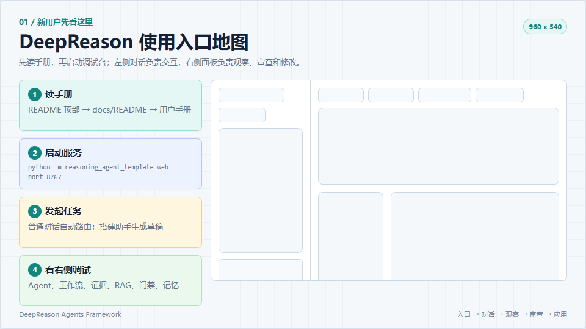
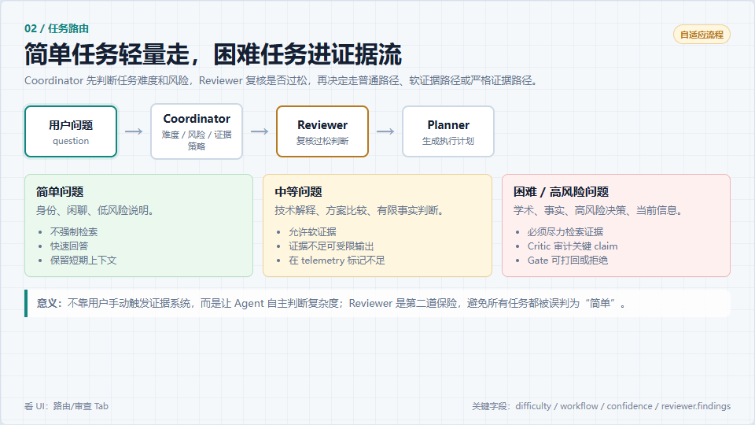
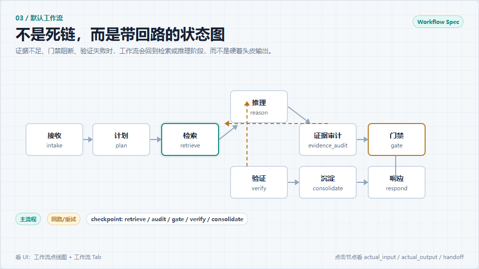
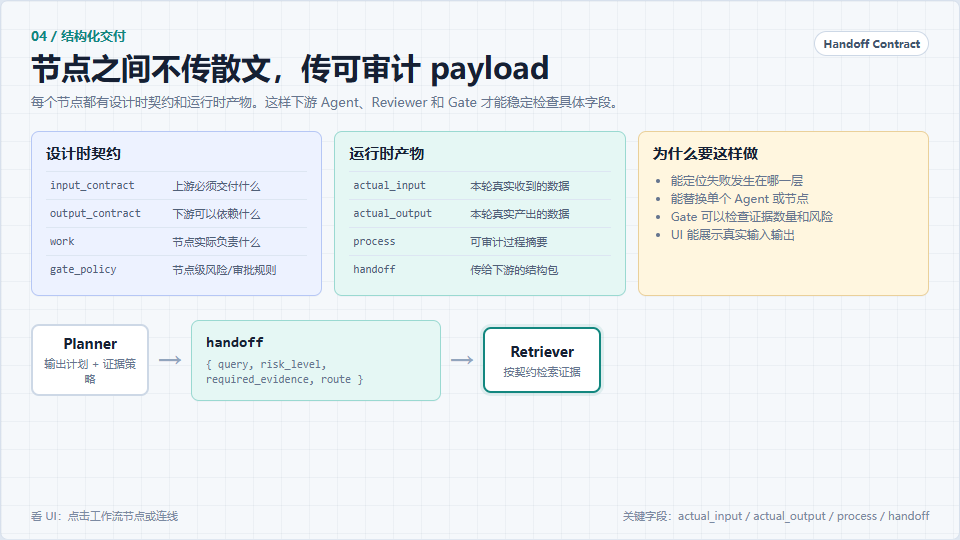
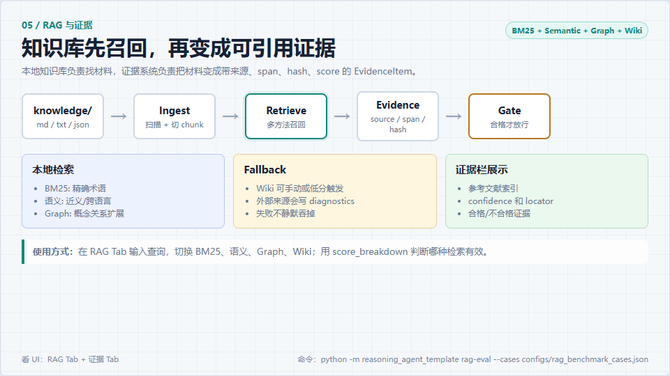
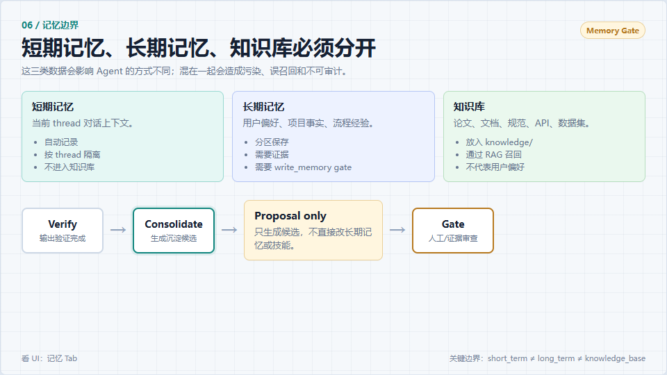
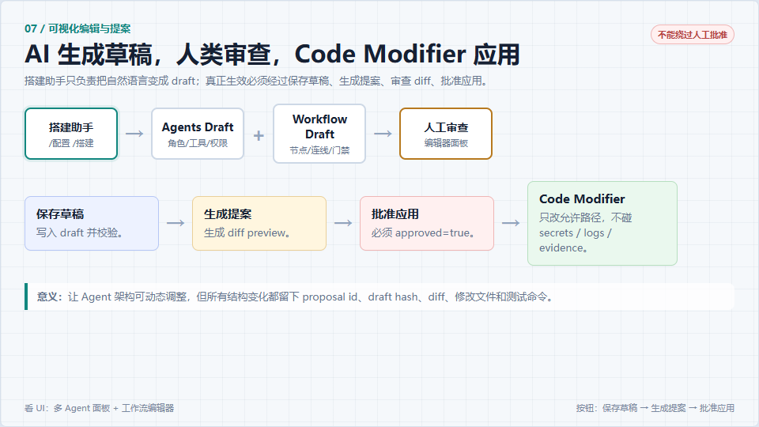
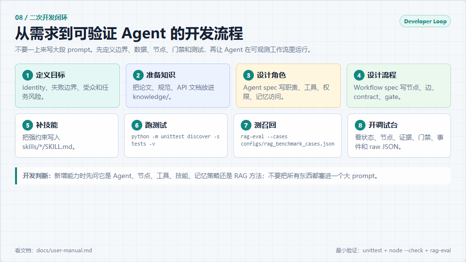

# 使用说明图片卡片

这一组图片用于笔记、教程或快速讲解。每张都是 `960 x 540`，单张约 `47-73KB`，尺寸和体积都控制在较小范围。

| 序号 | 图片 | 说明 |
|---|---|---|
| 01 | [入口地图](assets/usage-cards/01-entry-map.png) | 新用户从文档、服务启动、发起任务到调试观察的入口流程。 |
| 02 | [任务路由](assets/usage-cards/02-task-routing.png) | Coordinator/Reviewer 如何判断简单、中等、困难任务。 |
| 03 | [默认工作流](assets/usage-cards/03-default-workflow.png) | 带证据补充、门禁阻断、验证回路的默认状态图。 |
| 04 | [结构化交付](assets/usage-cards/04-structured-handoff.png) | 节点之间为什么要传 input/output/process/handoff。 |
| 05 | [RAG 与证据](assets/usage-cards/05-rag-evidence.png) | 知识库 ingest、混合检索、EvidenceItem 和 Gate 的关系。 |
| 06 | [记忆边界](assets/usage-cards/06-memory-boundaries.png) | 短期记忆、长期记忆和知识库的区别。 |
| 07 | [编辑与提案](assets/usage-cards/07-editor-proposal.png) | 搭建助手生成 draft，人工审查，Code Modifier 应用。 |
| 08 | [二开闭环](assets/usage-cards/08-developer-loop.png) | 从目标定义到测试、RAG 评测和调试台验证的开发流程。 |

## 预览

## 源文件

卡片源文件在 [source.html](assets/usage-cards/source.html)。需要调整文案或重新导出时，修改该 HTML 后重新截图即可。
