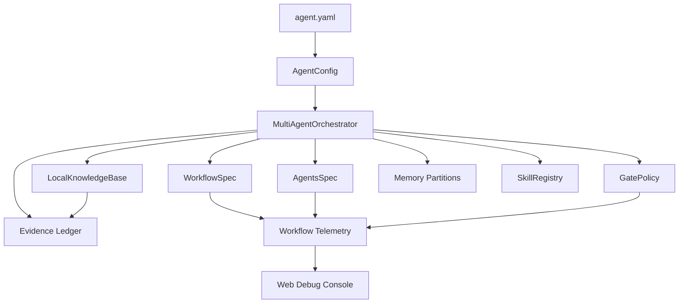

# DeepReason Agents Framework 使用指南

这份指南说明如何把 DeepReason Agents Framework 当成一个可二开的重推理 Agent 框架使用，而不是只当作演示项目运行。更完整的界面说明、功能区说明和学习路径见 [用户手册与学习手册](user-manual.md)。

## 1. 运行方式

### 本地调试台

```powershell
$env:PYTHONPATH='src'
python -m reasoning_agent_template web --host 127.0.0.1 --port 8767
```

打开 `http://127.0.0.1:8767/` 后，左侧是对话和搭建助手，右侧是调试控制台。

主要区域：

- 顶部状态条：当前 Agent、当前工作流节点、路由难度、证据状态、RAG 数量。
- 工作流点线图：展示实际 spec 节点、边、局部回路和节点状态。
- 多 Agent 面板：展示每个 Agent 的职责、绑定节点、工具和权限。
- 详情 Tab：查看证据、路由/审查、RAG、外部证据、工作流、门禁、记忆、技能、事件和原始 JSON。

### CLI

```powershell
$env:PYTHONPATH='src'
python -m reasoning_agent_template chat "你是谁？"
python -m reasoning_agent_template chat --json "解释这个框架的证据系统"
python -m reasoning_agent_template skills
python -m reasoning_agent_template test
python -m reasoning_agent_template rag-eval --cases configs/rag_benchmark_cases.json
```

安装后：

```powershell
reasoning-agent web
deepreason-agent web
```

## 2. 配置模型

`agent.yaml` 负责声明 planner、worker、critic、grader 的 provider/model。DeepSeek key 不要写进仓库文件，推荐写入本地 secret：

```json
{
  "deepseek_api_key": "sk-替换成你的-key",
  "deepseek_model": "deepseek-v4-flash"
}
```

保存为：

```text
configs/secrets.local.json
```

这个文件已经被 `.gitignore` 排除。

## 3. 理解核心模块



| 模块 | 你需要关心什么 |
|---|---|
| `agent.yaml` | 项目身份、模型、知识库、记忆、门禁、技能、自进化和 runtime 路径。 |
| `configs/agents/default.agents.json` | 定义 Agent 角色，不同角色负责不同节点、工具、记忆权限和交付。 |
| `configs/workflows/default.workflow.json` | 定义工作流图，节点之间通过 handoff contract 传递内容。 |
| `knowledge/` | 放论文、文档、规范、FAQ、实验资料等可检索源材料。 |
| `memory/` | 放长期记忆分区；它不是知识库，写入必须有证据和 gate。 |
| `skills/` | 放约束包和行为流程，适合沉淀“证据优先”“最小修改”等强规则。 |
| `evidence/ledger.jsonl` | 运行生成的证据账本，通常不作为源码提交。 |
| `evolution/proposals/` | 自进化提案，人工审查后再应用。 |

## 4. 任务难度与证据触发

框架的原则是：

- 简单聊天：不强制证据。
- 中等技术问题：允许有限证据，证据不足时仍可输出但要在 telemetry 中标记。
- 困难、学术、事实判断、高风险问题：必须尽可能检索本地 RAG、外部论文/网页、用户经验；证据不足会被 gate 打回或受限输出。

触发不是靠关键词硬编码，而是由 coordinator 与 reviewer 对任务难度、风险、时效性、事实性和可验证性做综合判断。

## 5. 建立知识库

把源文档放入：

```text
knowledge/
  domain/
    paper-summary.md
    lab-notes.md
  product/
    workflow-spec.md
```

建议：

- 每个文档有清晰标题和文档 ID。
- 同时写中文术语和英文别名，提升跨语言召回。
- 文档主题尽量单一。
- 不要把用户偏好、会话历史或密钥放进知识库。

运行评测：

```powershell
$env:PYTHONPATH='src'
python -m reasoning_agent_template rag-eval --cases configs/rag_benchmark_cases.json --report docs/rag-benchmark-latest.md
```

在 Web 调试台打开 `RAG` Tab，可切换 BM25、语义、Graph、Wiki 并查看 score breakdown。

## 6. 用搭建助手生成 Agent 和工作流

入口有两个：

- 点击左侧 `搭建助手`。
- 在普通对话里输入 `/配置 ...`、`/搭建 ...`、`#配置 ...` 或 `#搭建 ...`。

示例：

```text
/搭建 帮我做一个材料科学论文审查 Agent。需要 3-5 个 Agent，能检索论文证据，有 reviewer，有高风险结论门禁，最后输出参考文献。
```

搭建助手只生成 draft，不直接改运行中配置。生成后：

1. 打开 `多 Agent` 或 `工作流` 面板。
2. 审查字段和连接。
3. 点击保存草稿。
4. 生成 proposal。
5. 审查 diff。
6. 批准应用。

## 7. 编辑工作流

工作流节点字段：

- `id`: 稳定节点 ID。
- `label`: UI 显示名称。
- `agent`: 执行该节点的 Agent。
- `work`: 节点具体工作。
- `input_contract`: 上游必须交付什么。
- `output_contract`: 下游可以拿到什么。
- `handler_kind`: `builtin` 或 `plugin_tool`。
- `handler`: 实际处理器名称。
- `checkpoint`: 是否作为可恢复检查点。
- `gate_policy`: 节点级门禁策略。

边字段：

- `from` / `to`: 源节点和目标节点。
- `type`: `flow`、`branch`、`retry`、`revise`、`loop` 等。
- `condition`: 什么时候走这条边。
- `handoff_contract`: 边上的交付契约。
- `reviewer_required`: 是否需要 reviewer 审查。

## 8. 添加新功能的推荐方式

### 新增一个内置节点

1. 在 `configs/workflows/default.workflow.json` 添加节点和边。
2. 如果用新 handler，在 runtime 中添加对应处理逻辑。
3. 在 `tests/test_workflow_spec.py` 或相关测试里覆盖 spec 校验。
4. 在 `tests/test_multiagent_web.py` 覆盖 UI telemetry。

### 新增一个工具

1. 优先实现为薄 adapter。
2. 在 Agent spec 中声明可使用工具。
3. 对高风险工具接入 gate。
4. 给工具输出生成 evidence item 或 runtime event。

### 新增一个 RAG 方法

1. 扩展 `LocalKnowledgeBase`。
2. 在 `/api/rag/query` 支持 method 参数。
3. 补 `configs/rag_benchmark_cases.json`。
4. 跑 `rag-eval` 并更新报告。

### 新增一个技能

1. 新建 `skills/<name>/SKILL.md`。
2. 写清触发条件、强约束、执行步骤、禁止事项、验收标准。
3. 在 `agent.yaml` 启用。
4. 为技能加载补测试。

## 9. 测试清单

每次改动至少跑：

```powershell
$env:PYTHONPATH='src'
python -m unittest discover -s tests -v
node --check src\reasoning_agent_template\web_static\app.js
```

改 RAG 时加跑：

```powershell
python -m reasoning_agent_template rag-eval --cases configs/rag_benchmark_cases.json --report docs/rag-benchmark-latest.md
```

改 Web UI 时建议手动检查：

- 页面能打开。
- 工作流图非空。
- 点击节点/边能看到真实输入输出和交付数据。
- RAG Tab 能查询并返回结果。
- 没有水平溢出或文本重叠。

## 10. 开发边界

- 不要把 `configs/secrets.local.json` 提交到仓库。
- 不要把 `logs/`、运行中的 `evidence/ledger.jsonl` 当成源码提交。
- 不要让自进化直接修改核心技能或配置，必须走 proposal。
- 不要让 code_modifier 参与普通对话、证据检索或记忆沉淀。
- 不要把长期记忆当知识库；论文、文档、规范进 `knowledge/`，偏好和项目事实进 `memory/`。
